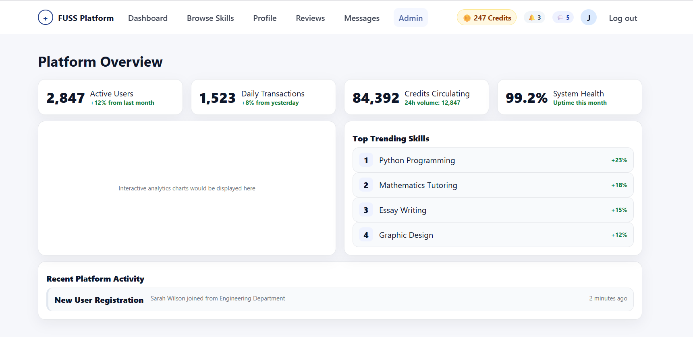
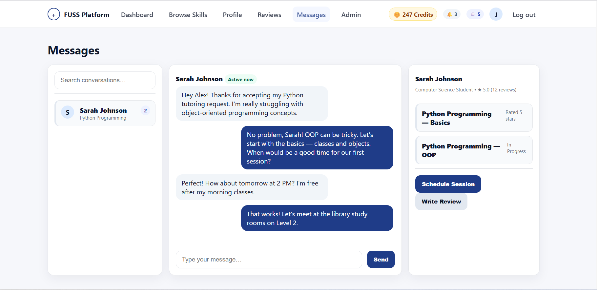
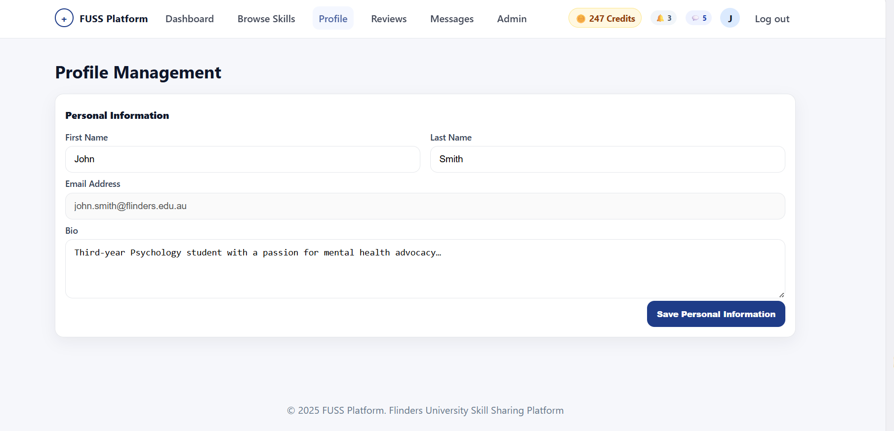
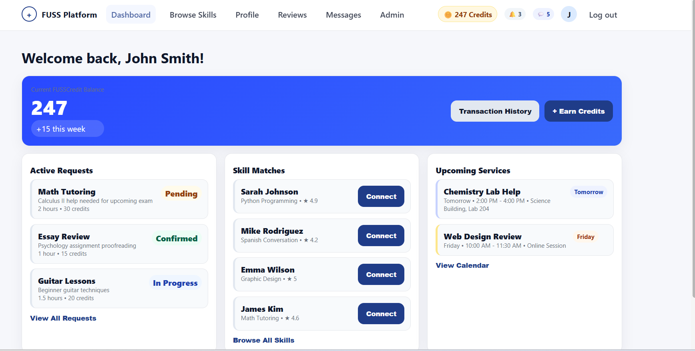
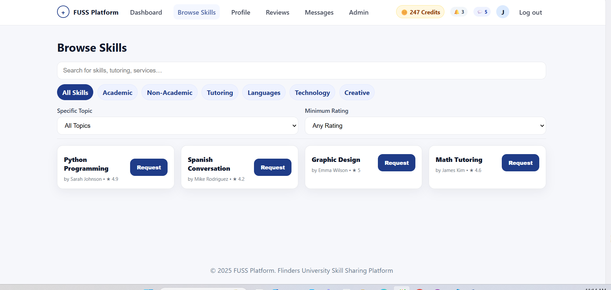

# Usability Evaluation, Iteration, and Demonstration
## Usability Test Plan
### Research Objectives
 The main goal of this usability test is to servey how work, easy, safety and usefull it is for students to use the FUSS website. This test will help find any problems that make it hard for users to move around the site, complete tasks, or understand the system’s feedback messages.
1. **Validate end-to-end workflows**: Assess registration, skill browsing, service requests, messaging, and credit deductions with ≥90% success.
2. **Measure efficiency and errors**: Track time-on-task, error recovery in backend operations (e.g., credit updates via MySQL).
3. **Assess information hierarchy**:Test whether key pages (Dashboard, Credits, Profile) follow a logical and discoverable structure within ≤ 3 clicks.
4. **Verify secure authentication flow**: Ensure registration and login correctly implement salted password hashing, secure sessions, and auto-timeout.
5. **Examine database transaction safety**: Introduce simultaneous write operations (e.g., concurrent credit transfers) to test MySQL transaction isolation and rollback reliability.
### Description of 5 Student Recruitment
| ID | Major|
| -- | -----|
|CAO0262| IT|
|alab0073| IT|
|suneha | IT |
|vu0168| IT |
|ahmc0423| Artificial Intelligence |
### Tasks (Frontend & Backend-Integrated)
Participants will perform five core tasks that cover both the front-end interface and PHP/MySQL backend:
1. Users can register a new account.
- From the login page, navigate to the user registration page.
- Fill in given user details (Flinders email, password, first/last name).
- Register account.
2. Users can reset their account password.
- From the login page, navigate to the password reset page.
- Fill in given email and new password details.
- Reset password.
3. Providers can add a new skill offering.
- From the provider dashboard, navigate to the "Add Skill" section.
- Enter given skill name, category, rating, description.
- Submit the new skill.
4. Students can request a skill service and pay with credits.
- From the browse skills page, select a skill (e.g., "Python Programming").
- Choose duration and confirm credit cost.
- Submit request and deduct credits.
5. Admins can view user activity logs.
- From the admin dashboard, select a user (e.g., by email).
- View recent activities (requests, messages, reviews).
- Export log if needed
### Methodology
- **Pre-test**: Demographics questionnaire 
- **During**: Think-aloud; screenshort; observation notes; backend logs for errors/latency.
- **Post-task**: SEQ (1-7 difficulty/confidence).
- **Post-session**: SUS; open-ended interview.
- **Tools**: in person, Google Forms.
### Metrics Suscess
| Metric | Target |
|--------|--------|
| **Completion** | ≥90% |
| **SUS Avg** | ≥78 |
| **SEQ Avg** | ≥6/7 |
| **Time-on-Task** | ≤60s avg |
| **Errors** | ≤1/user
## Testing Summary and Analysis
## Iteration Description
1. Credit System

- Issue:
Participants noticed that credit balances sometimes displayed incorrect totals after booking or completing a session. Some users refreshed the page to see updates, and the credit purpose was unclear for new users.

- Change Implement:
All credit operations update to use MySQL transactions with commit and rollback protection to prevent duplicate or failed deductions. The frontend enhance with real-time AJAX updates so the credit balance refreshes instantly after each transaction.
Tooltips and contextual messages (“You earned 20 credits from teaching!” or “15 credits deducted for session booking”) were added for transparency.

- Impact:
Users now see accurate, instant credit changes and understand how the credit system works. Transaction reliability and backend security improved significantly.

2. Messaging System

- Issue:
The original messaging interface allowed only plain-text messages. Users requested a more interactive and modern chat experience, including group messaging, file sharing, and expressive communication options.

- Change Implement:
The messaging module refactor to support group chat creation with a “+ New Group” button. It could Upload (file, image, and link) using PHP file handling with storage path verification to prevent unsafe file types.
The messaging could add stickers  an open-source emoji picker (emoji-mart).

- Impact:
Communication became richer and more collaborative, especially for group study and multi-user tutoring sessions. The interface remains clean while providing modern chat features users expect.

3. Profile Management

- Issue:
Participants wanted to personalise their profiles with more context, such as profile pictures, skill portfolios, and academic background, to improve trust between users.

- Change Implement:
The profile system upgrad with image upload functionality (JPEG/PNG validation, 2 MB limit) and server-side sanitization.
New parts need to update for academic information such as (degree, major, year level) and skill portfolio links (GitHub, LinkedIn, or personal websites).
The layout will add more with clear sections (“Personal Info,” “Academic Info,” “Portfolio”) to provide personal information.

- Impact:
Profiles provide a more complete and credible representation of each user, fostering trust and professionalism in skill exchanges.

4. Skill Browsing & Dashboard

- Issue:
In the skill browsing section, users could see skill cards but lacked details about the helper (e.g., experience or verification). The dashboard also felt underutilized and was limited to system metrics.

- Change Implement:
Each skill card now includes a “View Helper Profile” button that opens a modal showing the helper’s bio, academic info, and average review rating. This transparency helps users choose reliable tutors.
The Dashboard expand to include a “Career & Opportunities” section that aggregates internship and job links from the university’s careers API. This enhances the platform’s relevance to students’ real-world goals.

- Impact:
Skill browsing is now more informative and trustworthy, and the dashboard provides meaningful content beyond statistics—encouraging continuous platform engagement.
## Appendix
### Script
Welcome to FUSS testing. WE are really need you feedback to update and developt a new version that bring better experience. In process, you will fill a short questionnaire first, then 5 tasks with rating after each. 
### Pre-test and Post-test Questionnaire.

